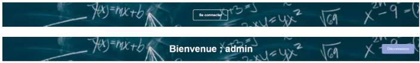
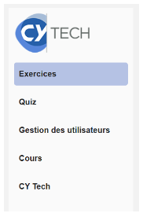
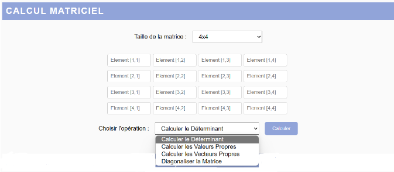
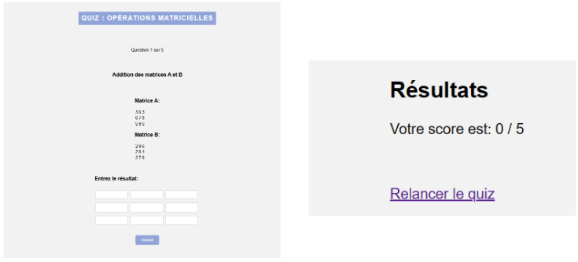
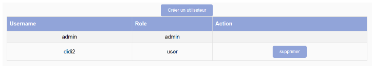
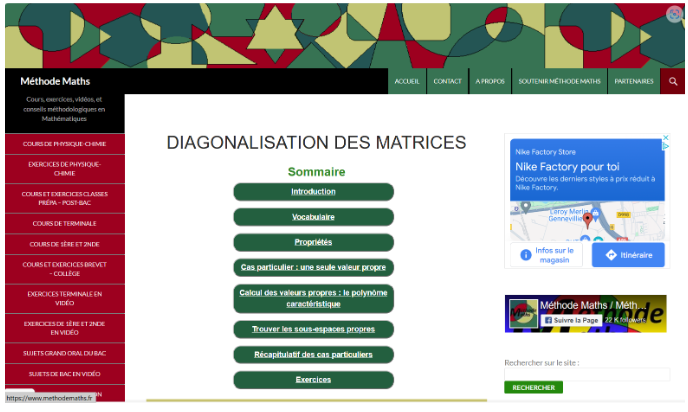
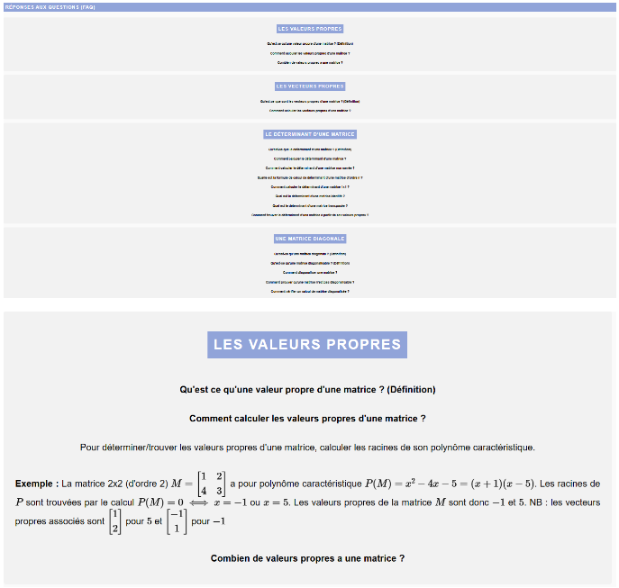
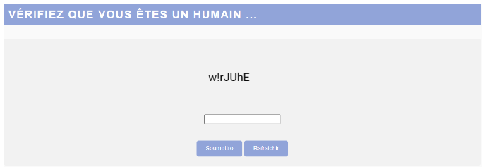
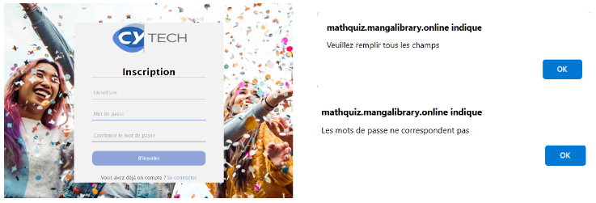

# MathQuiz

Lien pour acceder au site : https://templates.mangalibrary.online/bouhorma/

Pour accéder à l'interface administrateur  : identifiant : admin ; mot de passe : admin

# Introduction : 

Le site "MathQuiz" vise à fournir une plateforme éducative et pratique pour les étudiants, leur offrant la possibilité de s'exercer et de tester leurs connaissances en résolvant des problèmes de matrices (calcul du déterminant, diagonalisation de matrices, calcul des valeurs propres, calcul des vecteurs propre, somme et soustraction de matrices)  et en répondant à des quiz afin d'évaluer et d'améliorer leurs compétences en calcul matriciel. 

# Description du site :

Une bannière dans le haut de la page qui nous permet d'accéder à la page de connexion ou d’inscription, si c’est déjà fait la bannière affiche un message de bienvenu ainsi qu’un bouton pour se déconnecter

Un menu dans la colonne de gauche pour accéder aux différentes parties du site : Exercices, Quiz, Gestion des utilisateur (cette possibilité ne s’affiche que si on est connecté en administrateur), Cours, CY Tech.

Dans la partie Exercice, on trouve une interface pour la saisie de matrices allant de 2x2 à 4x4 et l'affichage des résultats après calcul du déterminant, calcul des valeurs propres, calcul des vecteurs propres ou diagonalisation de la matrice.

Dans la partie Quiz, on trouve des questions auxquelles l’utilisateur peut répondre, ces questions peuvent porter sur l’addition, la soustraction, la multiplication ou la transposition de matrices et chaque quiz se termine au bout de 5 questions et affiche le résultat obtenu.

Dans la partie Gestion des utilisateurs, on trouve un tableau avec tous les utilisateurs inscrits, l’administrateur a alors la possibilité de supprimer ou de créer un nouvel utilisateur.

Dans la partie Cours, on peut accéder à un autre site : Diagonalisation des matrices | Méthode Maths (methodemaths.fr) qui propose des cours sur les matrices.

Dans la partie CY Tech, on accède au site de l'école : CY Tech | CY Cergy Paris Université (cyu.fr) .

La page d’accueil affiche une FAQ (foire aux questions) sous la rubrique Réponses aux questions qui est séparée en plusieurs parties : Les valeurs propres, Les vecteurs propres, Le déterminant d’une matrice, Une matrice diagonale et qui dès lors qu’on clique sur une des questions affiche la réponse à cette question. Les réponses à ces questions viennent du site : https://www.dcode.fr/liste-outils#matrix . 

Une bannière en bas de la page avec des liens dans des logos pour accéder aux différents réseaux sociaux de l’école.

Lorsque vous souhaitez vous connecter ou accéder à la rubrique Quiz, vous devez d’abord vérifier que vous êtes un humain et pour cela résoudre un captcha (Completely Automated Public Turing test to tell Computers and Humans Apart). Un captcha est une séquence aléatoire de lettres et/ou de chiffres affichée de manière déformée, accompagnée d'une zone de texte. Pour réussir le test, il suffit de saisir les caractères de l'image dans la zone de texte prévue à cet effet. Si le captcha est trop compliqué vous pouvez toujours rafraîchir et il vous sera alors proposé une autre suite de caractère.

Pour se connecter il suffit d’entrer un identifiant et un mot de passe. Si l’utilisateur n’a pas de compte il peut alors en créer un en cliquant sur : S’inscrire.

Pour se connecter en tant qu’administrateur l’identifiant est : admin et le mot de passe est admin.

Pour s’inscrire il faut rentrer l’identifiant qu’on souhaite avoir, un mot de passe et confirmer ce mot de passe. Si les mots de passe ne correspondent pas ou que certains champs ne sont pas remplis alors un message d’erreur s’affiche et précise à l’utilisateur le problème à régler.

